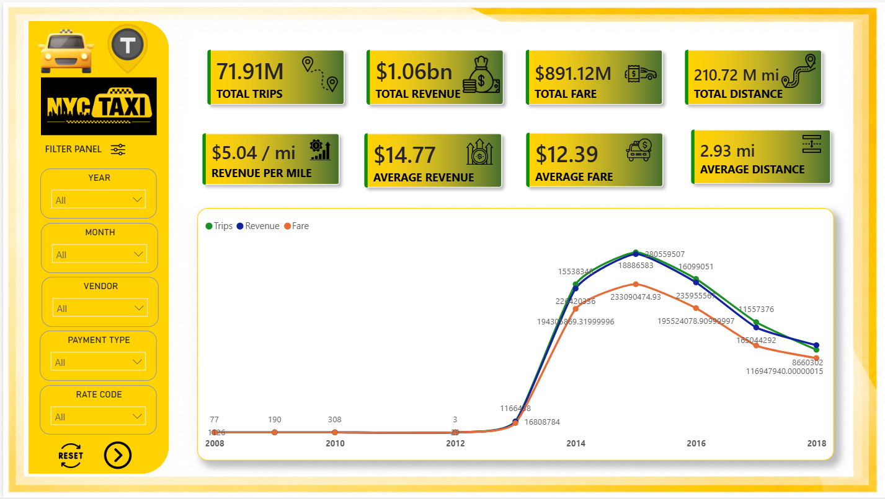
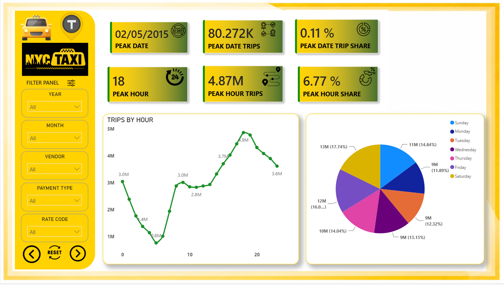
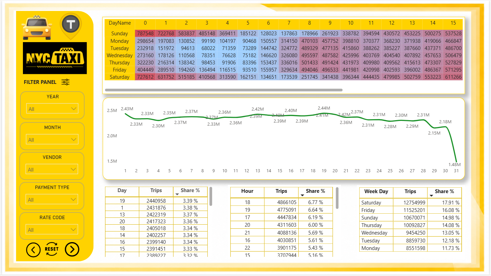
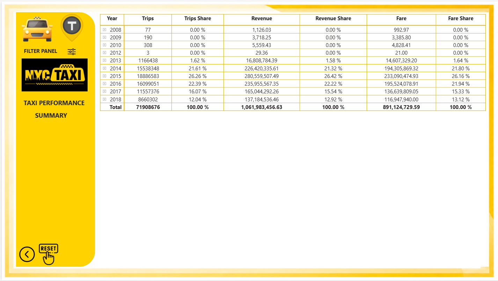

# NYC Taxi Analytics Project

```text
This project demonstrates an end-to-end data engineering solution using Microsoft Fabric.
The pipeline ingests NYC Taxi data into a Lakehouse architecture using Bronze, Silver, and Gold layers. Data is transformed using notebooks and visualized through Power BI dashboards using Direct Lake semantic models.
```

## Architecture

```text
This project demonstrates an end-to-end data engineering solution using Microsoft Fabric.

The pipeline ingests NYC Taxi data into a Lakehouse architecture using Bronze, Silver, and Gold layers. Data is transformed using notebooks and visualized through Power BI dashboards using Direct Lake semantic models.
```

```text
Source (NYC Taxi Sample Data)
        ↓
Ingestion (Fabric Pipeline / Copy Activity)
        ↓
Bronze Layer (Raw Files in Lakehouse)
        ↓
Silver Layer (Cleaned & Transformed Data)
        ↓
Gold Layer (Fact & Dimension Tables)
        ↓
Semantic Model 
        ↓
Power BI Report / Dashboard
```
## Dashboard Preview

| Dashboard 1 | Dashboard 2 |
|------------|------------|
|  |  |

| Dashboard 3 | Dashboard 4 |
|------------|------------|
|  |  |
## Tech Stack

- Microsoft Fabric
- Lakehouse Architecture
- PySpark
- SQL
- Power BI
- Direct Lake Semantic Model
- Data Pipelines


---

# Data Dictionary

## Fact Table

### `anurag_gold_fact_trips`

Stores trip-level transactional data.

| Column | Description |
|---|---|
| TripID | Unique identifier for each trip |
| PickUpDate | Pickup date |
| PickUpTime | Pickup timestamp |
| DropOffTime | Dropoff timestamp |
| DropOffDate | Drop Date|
| passengerCount | Number of passengers |
| tripDistance | Distance traveled in miles |
| fareAmount | Total fare amount in USD |
| paymentType | Payment type key |
| VendorID | Vendor key |
| rateCodeID | The final rate code  at the end of the trip |
| storeAndFwdFlag | This flag indicates whether the trip record was held in vehicle memory before sending to the vendor, also known as “store and forward,” because the vehicle did not have a connection to the server |
| extra  | Miscellaneous extras and surcharges. Currently, this only includes the $0.50 and $1 rush hour and overnight charges. |
| mtaTax | Meter Tax |
| improvementSurcharge | $0.30 improvement surcharge assessed on hailed trips at the flag drop. The improvement surcharge began being levied in 2015 |
| tipAmount | Tip AMount given to drivers |
| tollsAmount | Total amount of all tolls paid in trip. |
| totalAmount| The total amount charged to passengers. Does not include cash tips |
| tripType | A code indicating whether the trip was a (0) street-hail or a (1) dispatch |


---

## Dimension Tables

### `anurag_gold_dim_date`

Contains calendar/date information.

| Column | Description |
|---|---|
| Date | Full date |
| Year | Year |
| Month | Intgers based Month (1-12) |
| MonthName | Name Of Month |
| DayName | Name Of (Week  Day) |
| Quarter | FY Quarters |
| Day | Day number (1–31) |
| WeekOfYear | Integerbased week within a fy year |
| DayNumber | Intgers based Day (1-7) |

---

### `anurag_gold_dim_time`

Contains time-level details.

| Column | Description |
|---|---|
| hour | Hour of day (0–23) |
| Minute | Minute value |
| Second | Second Value |
| Time   | HH:MM:SS |

---

### `anurag_gold_dim_vendor`

Vendor reference information.

| Column | Description |
|---|---|
| VendorID | Vendor identifier |
| VendorName | Taxi vendor/provider |

---


---

### `anurag_gold_dim_ratecode`

Rate Code References

| Column | Description |
|---|---|
| rateCodeId| Integer based rate code |
| RateCodeName| Description about rate code |

---

---

### `anurag_gold_dim_storeforward`

Store & Forward   Code References

| Column | Description |
|---|---|
| StoreForwardID| Integer Based Description |
| StoreAndFwdFlag| String Based Description  |
|  Description| Description about storeforward |

---


### `anurag_gold_dim_paymenttype`

Payment Options

| Column | Description |
|---|---|
|PaymentTypeID | Integer Based Description |
|PaymentType | String Based Description  |


---

### `anurag_gold_dim_triptype`

Trip Type & Descriptions

| Column | Description |
|---|---|
|TripTypeID | Integer Based Description |
|TripType | String Based Description  |


---


## Business KPIs

- Total Trips
- Total Revenue
- total Fare
- Total Distance
- Revenure Per Mile
- Average Revenue 
- Average Fare
- Average Distance
- Yearly Line Chart of Trips , Revenue and Fare
- Peak Date
- Peak Date Trips
- Peak Date Trip Share
- Peak Hour
- Peak Hour Trips
- Peak Hour Share
- Trips By Hour
- Weekday Share
- Heat Map Weekday x Hours
- Date (0-31) Trips Analysis
- Table with Day, Hour , WeekDay their trips and Share ,Share %
- Drill Down 


## Slicers

- YEAR
- MONTH
- VENDOR
- PAYMENT TYPE
- RATE CODE

## Validation Checks

- Null value validation
- Duplicate removal checks
- Data type validation
- Row count verification

# Steps to Reproduce

## Step 1 — Run Ingestion Pipeline

Open:

`Anurag_Taxi_Pipeline`

Run the pipeline to:
- Copy raw NYC Taxi data
- Load data into Bronze layer

---

## Step 2 — Silver Layer Transformation

Pipeline automatically runs:

`Anurag_Silver_Layer_Notebook`

This notebook:
- Cleans null values
- Standardizes datatypes
- Removes invalid records
- Creates transformed silver tables

---

## Step 3 — Gold Layer Transformation

Pipeline automatically runs:

`Anurag_Gold_Layer_Notebook`

This notebook:
- Creates fact tables
- Creates dimension tables
- Implements star schema model

---

## Step 4 — Semantic Model Refresh

Pipeline refreshes:

`Anurag_Taxi_Semantic_Model`

using Direct Lake mode.

---

## Step 5 — Open Power BI Report

Open:

`Anurag_Taxi_Report`

Dashboard automatically reflects latest refreshed data.

---

# Known Issues

- Large datasets increase query execution time.
- Append mode initially caused duplicate records.
- Query performance can reduce with very large row counts.
- Some Integer based values are in string format with with blank values in it

---

# Future Improvements

If given more time, the following enhancements would be implemented:

- Incremental data loading
- Row-level security (RLS)
- Alerting and monitoring for pipeline failures
- Advanced KPI drill-through analysis
- Ananlysis like Year On Year , Month On Month Evaluation Analysis
- Query Optimization
